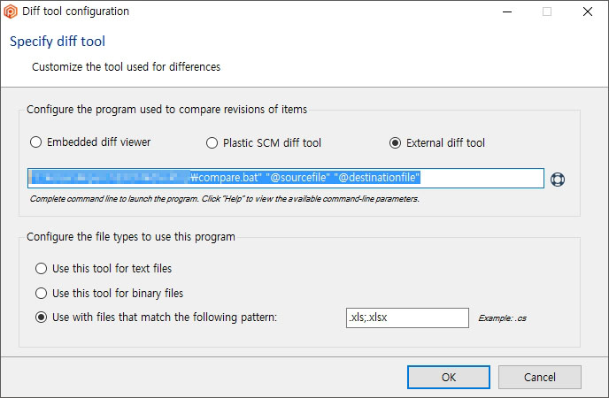
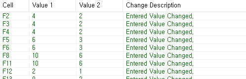

# excel

## 목차

- Spreadsheet Compare


## Spreadsheet Compare
두 엑셀 간 변경점을 비교해주는 도구. MS Office에 포함되어있다.


### 설정 방법

#### 레지스트리를 수정한다.

MS Office 2016 나온 이래, Spreadsheet Compare를 실행하자 마자 뻗는 버그가 있다. 레지스트리에 값을 하나 추가하여 문제를 수정할 수 있다. [[링크]](https://excel.uservoice.com/forums/304921-excel-for-windows-desktop-application/suggestions/18601555-spreadsheet-compare-does-not-work-with-64-bit-offi)

```
Windows Registry Editor Version 5.00

[HKEY_CURRENT_USER\SOFTWARE\Microsoft\Office\16.0\Common\Identity]
"EnableADAL"=dword:00000000
```

#### compare.bat 파일을 적절한 경로에 둔다.

Spreadsheet Compare 는 비교할 파일 경로가 들어있는 텍스트 파일을 인자로 받아 실행하며 텍스트 파일을 지우는 방식으로 실행한다. 때문에 배치 파일로 경로 2개를 받아 임시 텍스트 파일을 만들고, 그 텍스트 파일을 인자로 넣는 방식으로 Spreadsheet Compare를 실행해야 한다. [[링크]](https://github.com/kniklas/excomp/blob/master/excomp.bat)

```
@echo off

: MS OFFICE 설치 경로를 입력합니다.
SET OFFICE_PATH="C:\Program Files (x86)\Microsoft Office\Office16"

dir %1 /B /S > %userprofile%\temp.txt
dir %2 /B /S >> %userprofile%\temp.txt
start /D %OFFICE_PATH%"\DCF" SPREADSHEETCOMPARE.EXE %userprofile%\temp.txt
```

#### 버전 관리도구에서 외부 diff 도구로 bat 파일을 지정

PSCM의 경우 아래와 같이 지정하면 된다.

```
"{compare.bat 파일 위치}" "@sourcefile" "@destinationfile"
```



#### 결과
두 파일 간 비교가 잘 된다.



